# PRD — Portal Warga Berbasis Web dan Mobile

**Proyek:** Rancang Bangun Sistem Portal Warga Berbasis Web dan Mobile
**Teknologi:** Laravel 13 (Backend API) · ReactJS (Admin Web) · Flutter (Aplikasi Warga Mobile)
**Versi:** 1.1
**Tanggal:** Juli 2026

---

## Daftar Isi

1. [Latar Belakang](#1-latar-belakang)
2. [Tujuan](#2-tujuan)
3. [Pengguna Sistem](#3-pengguna-sistem)
4. [Fitur Lengkap](#4-fitur-lengkap)
5. [Flowchart Admin Web](#5-flowchart-admin-web)
6. [Flowchart Warga Mobile](#6-flowchart-warga-mobile)
7. [Arsitektur Teknis](#7-arsitektur-teknis)
8. [Non-Functional Requirements](#8-non-functional-requirements)
9. [Fase Pengembangan](#9-fase-pengembangan)
10. [Struktur Tim](#10-struktur-tim)

---

## 1. Latar Belakang

Saat ini interaksi antara warga dan pengurus RT/RW masih dilakukan secara manual (tatap muka, grup WhatsApp, catatan fisik). Hal ini menyebabkan:

- Data warga tersebar dan tidak terpusat
- Pengaduan dan permohonan surat sulit dilacak statusnya
- Informasi pengumuman tidak terdokumentasi dengan baik
- Pelaporan iuran keuangan tidak transparan

Dibutuhkan sistem portal warga yang terintegrasi berbasis web (untuk admin/pengurus) dan mobile (untuk warga) agar pengelolaan data dan komunikasi warga menjadi lebih efektif dan transparan.

---

## 2. Tujuan

1. Menyediakan platform terpusat untuk pengelolaan data warga
2. Memudahkan warga mengajukan pengaduan dan permohonan surat secara digital
3. Meningkatkan transparansi iuran dan keuangan RT/RW
4. Menyediakan saluran informasi dan komunikasi yang efektif antara pengurus dan warga
5. Mendokumentasikan semua kegiatan dan arsip surat secara digital

---

## 3. Pengguna Sistem

| Role | Platform | Deskripsi |
|------|----------|-----------|
| **Super Admin** | Web (ReactJS) | Mengelola seluruh sistem, termasuk admin lain |
| **Admin RT/RW** | Web (ReactJS) | Mengelola data warga, pengaduan, surat, iuran di lingkup RT/RW-nya |
| **Warga** | Mobile (Flutter) | Mengakses informasi, mengajukan pengaduan/surat, membayar iuran |

---

## 4. Fitur Lengkap

| No | Modul | Admin Web | Warga Mobile |
|----|-------|-----------|--------------|
| 1 | Autentikasi | Login email & password, role-based | Login NIK + password & Register |
| 2 | Dashboard | Kartu statistik, grafik, akses cepat | Info ringkas, berita terbaru, aksi cepat |
| 3 | Berita & Pengumuman | CRUD + draft/publikasi | Lihat, filter, share |
| 4 | Pengaduan | Kelola status, tanggapi | Ajukan, pantau timeline, rating |
| 5 | Surat | Setujui/tolak, generate PDF | Ajukan, download PDF |
| 6 | Data Warga | CRUD, import/export Excel | Lihat & edit profil |
| 7 | RT/RW | Atur struktur organisasi | Lihat info pengurus |
| 8 | Iuran & Keuangan | Catat pemasukan/pengeluaran, laporan | Bayar iuran, lihat riwayat |
| 9 | Agenda Kegiatan | CRUD agenda | Lihat, RSVP |
| 10 | Galeri | CRUD album foto | Lihat foto full screen |
| 11 | Notifikasi | Dikirim dari aksi admin | FCM push, navigasi ke halaman terkait |
| 12 | Manajemen Admin | CRUD admin, atur role | — |

---

## 5. Flowchart Admin Web

### 5.1 Autentikasi

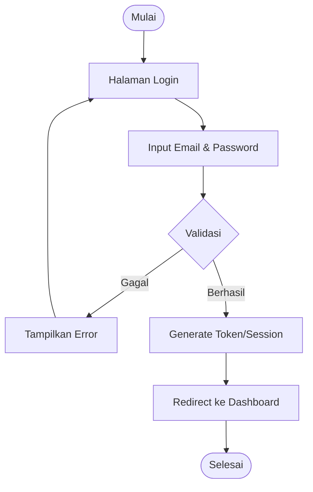
```mermaid
flowchart TD
    A([Mulai]) --> B[Halaman Login]
    B --> C[Input Email & Password]
    C --> D{Validasi}
    D -->|Gagal| E[Tampilkan Error]
    E --> B
    D -->|Berhasil| F[Generate Token/Session]
    F --> G[Redirect ke Dashboard]
    G --> H([Selesai])
```

### 5.2 Dashboard

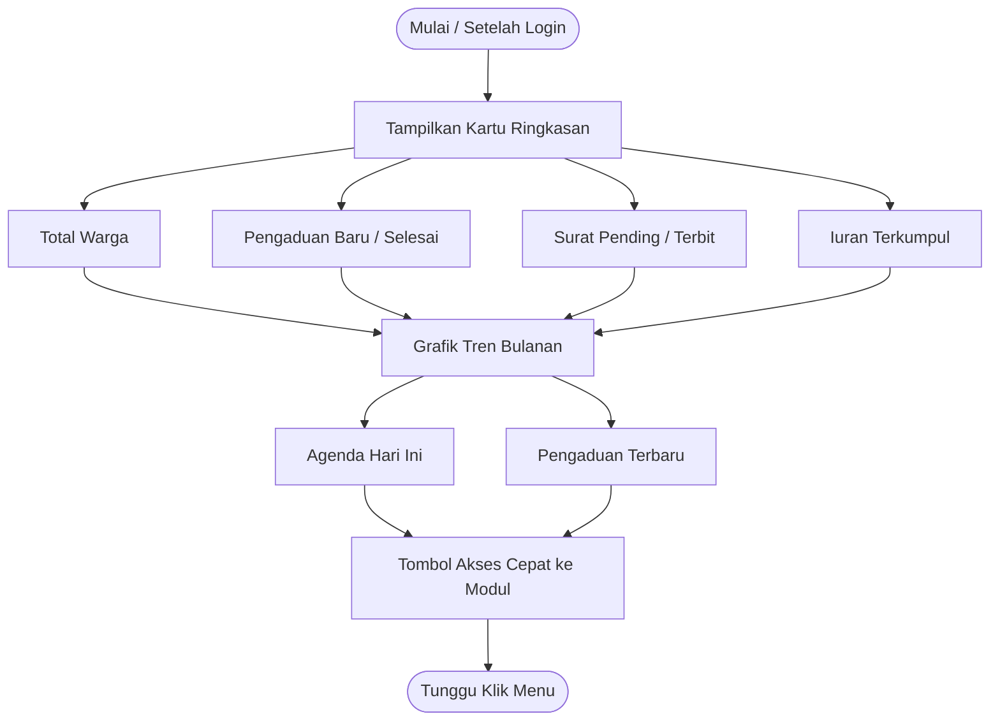
```mermaid
flowchart TD
    A([Mulai / Setelah Login]) --> B[Tampilkan Kartu Ringkasan]
    B --> C[Total Warga]
    B --> D[Pengaduan Baru / Selesai]
    B --> E[Surat Pending / Terbit]
    B --> F[Iuran Terkumpul]
    C --> G[Grafik Tren Bulanan]
    D --> G
    E --> G
    F --> G
    G --> H[Agenda Hari Ini]
    G --> I[Pengaduan Terbaru]
    H --> J[Tombol Akses Cepat ke Modul]
    I --> J
    J --> K([Tunggu Klik Menu])
```

### 5.3 Manajemen Pengaduan

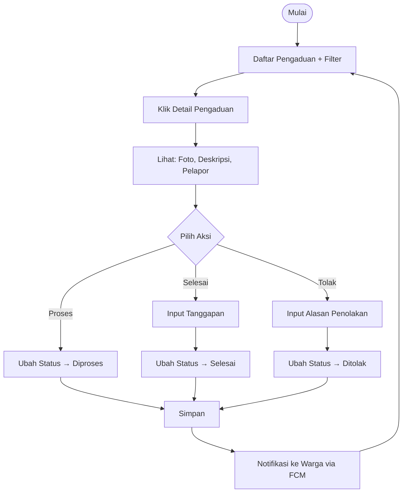
```mermaid
flowchart TD
    A([Mulai]) --> B[Daftar Pengaduan + Filter]
    B --> C[Klik Detail Pengaduan]
    C --> D[Lihat: Foto, Deskripsi, Pelapor]
    D --> E{Pilih Aksi}

    E -->|Proses| F[Ubah Status → Diproses]
    F --> G[Simpan]
    G --> H[Notifikasi ke Warga via FCM]
    H --> B

    E -->|Selesai| I[Input Tanggapan]
    I --> J[Ubah Status → Selesai]
    J --> G

    E -->|Tolak| K[Input Alasan Penolakan]
    K --> L[Ubah Status → Ditolak]
    L --> G
```

### 5.4 Manajemen Surat

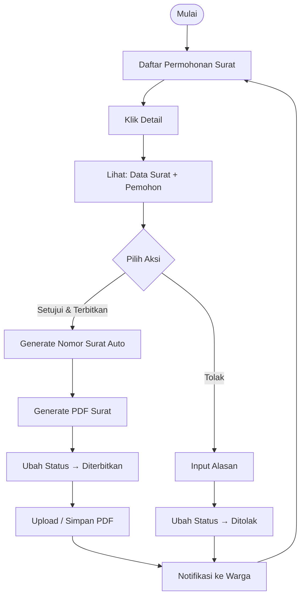
```mermaid
flowchart TD
    A([Mulai]) --> B[Daftar Permohonan Surat]
    B --> C[Klik Detail]
    C --> D[Lihat: Data Surat + Pemohon]
    D --> E{Pilih Aksi}

    E -->|Setujui & Terbitkan| F[Generate Nomor Surat Auto]
    F --> G[Generate PDF Surat]
    G --> H[Ubah Status → Diterbitkan]
    H --> I[Upload / Simpan PDF]
    I --> J[Notifikasi ke Warga]
    J --> B

    E -->|Tolak| K[Input Alasan]
    K --> L[Ubah Status → Ditolak]
    L --> J
```

### 5.5 Manajemen Berita & Pengumuman

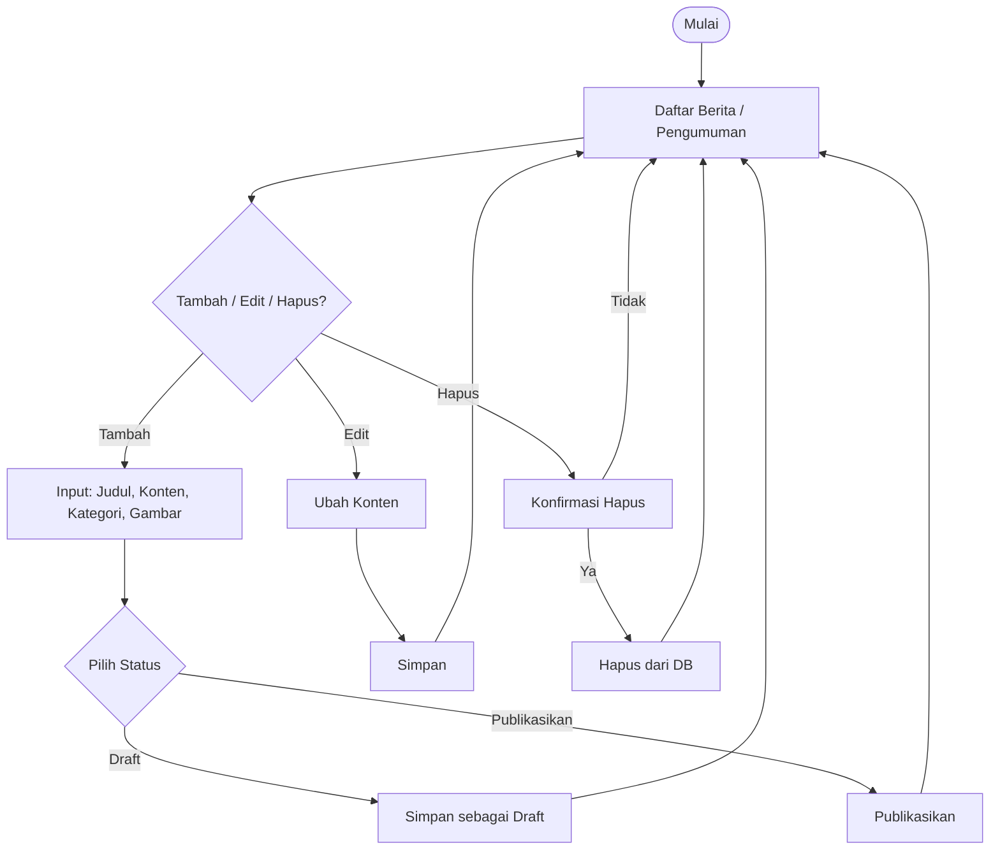
```mermaid
flowchart TD
    A([Mulai]) --> B[Daftar Berita / Pengumuman]

    B --> C{Tambah / Edit / Hapus?}

    C -->|Tambah| D[Input: Judul, Konten, Kategori, Gambar]
    D --> E{Pilih Status}
    E -->|Draft| F[Simpan sebagai Draft]
    E -->|Publikasikan| G[Publikasikan]
    F --> B
    G --> B

    C -->|Edit| H[Ubah Konten]
    H --> I[Simpan]
    I --> B

    C -->|Hapus| J[Konfirmasi Hapus]
    J -->|Ya| K[Hapus dari DB]
    K --> B
    J -->|Tidak| B
```

### 5.6 Manajemen Data Warga

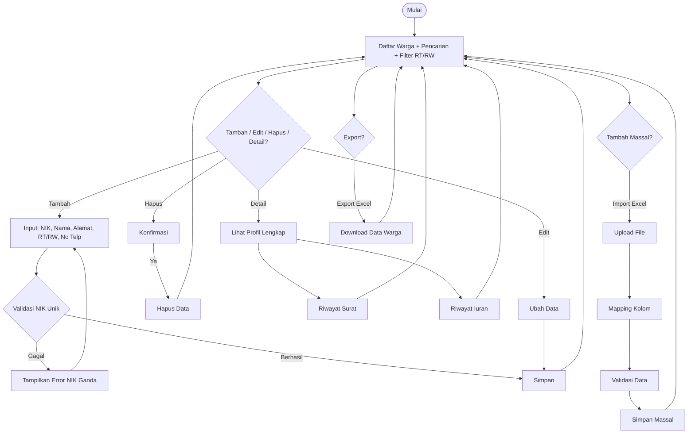
```mermaid
flowchart TD
    A([Mulai]) --> B[Daftar Warga + Pencarian + Filter RT/RW]

    B --> C{Tambah / Edit / Hapus / Detail?}

    C -->|Tambah| D[Input: NIK, Nama, Alamat, RT/RW, No Telp]
    D --> E{Validasi NIK Unik}
    E -->|Gagal| F[Tampilkan Error NIK Ganda]
    F --> D
    E -->|Berhasil| G[Simpan]
    G --> B

    C -->|Edit| H[Ubah Data]
    H --> G

    C -->|Hapus| I[Konfirmasi]
    I -->|Ya| J[Hapus Data]
    J --> B

    C -->|Detail| K[Lihat Profil Lengkap]
    K --> L[Riwayat Surat]
    K --> M[Riwayat Iuran]
    L --> B
    M --> B

    B --> N{Tambah Massal?}
    N -->|Import Excel| O[Upload File]
    O --> P[Mapping Kolom]
    P --> Q[Validasi Data]
    Q --> R[Simpan Massal]
    R --> B

    B --> S{Export?}
    S -->|Export Excel| T[Download Data Warga]
    T --> B
```

### 5.7 Manajemen RT/RW

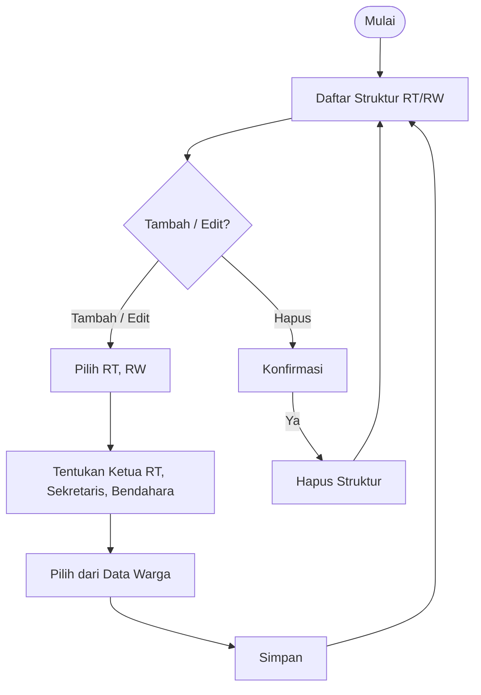
```mermaid
flowchart TD
    A([Mulai]) --> B[Daftar Struktur RT/RW]
    B --> C{Tambah / Edit?}
    C -->|Tambah / Edit| D[Pilih RT, RW]
    D --> E[Tentukan Ketua RT, Sekretaris, Bendahara]
    E --> F[Pilih dari Data Warga]
    F --> G[Simpan]
    G --> B
    C -->|Hapus| H[Konfirmasi]
    H -->|Ya| I[Hapus Struktur]
    I --> B
```

### 5.8 Manajemen Iuran & Keuangan

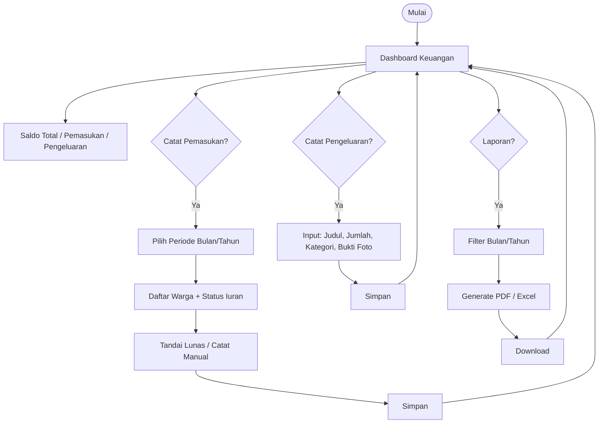
```mermaid
flowchart TD
    A([Mulai]) --> B[Dashboard Keuangan]
    B --> C[Saldo Total / Pemasukan / Pengeluaran]

    B --> D{Catat Pemasukan?}
    D -->|Ya| E[Pilih Periode Bulan/Tahun]
    E --> F[Daftar Warga + Status Iuran]
    F --> G[Tandai Lunas / Catat Manual]
    G --> H[Simpan]
    H --> B

    B --> I{Catat Pengeluaran?}
    I -->|Ya| J[Input: Judul, Jumlah, Kategori, Bukti Foto]
    J --> K[Simpan]
    K --> B

    B --> L{Laporan?}
    L -->|Ya| M[Filter Bulan/Tahun]
    M --> N[Generate PDF / Excel]
    N --> O[Download]
    O --> B
```

### 5.9 Agenda Kegiatan

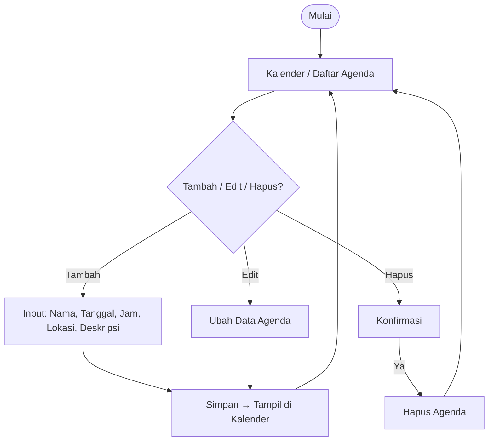
```mermaid
flowchart TD
    A([Mulai]) --> B[Kalender / Daftar Agenda]
    B --> C{Tambah / Edit / Hapus?}
    C -->|Tambah| D[Input: Nama, Tanggal, Jam, Lokasi, Deskripsi]
    D --> E[Simpan → Tampil di Kalender]
    E --> B
    C -->|Edit| F[Ubah Data Agenda]
    F --> E
    C -->|Hapus| G[Konfirmasi]
    G -->|Ya| H[Hapus Agenda]
    H --> B
```

### 5.10 Galeri

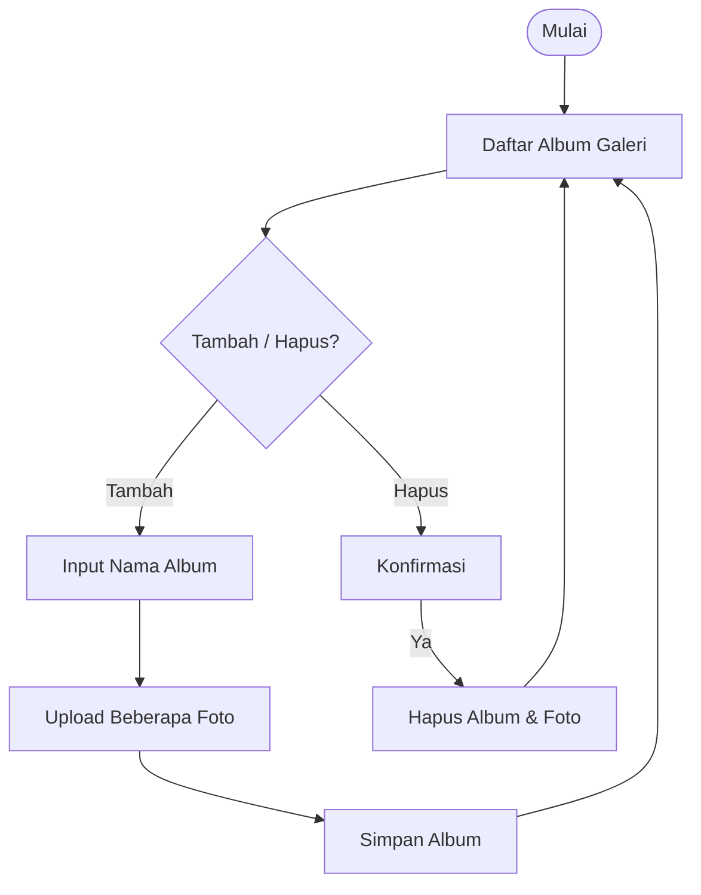
```mermaid
flowchart TD
    A([Mulai]) --> B[Daftar Album Galeri]
    B --> C{Tambah / Hapus?}
    C -->|Tambah| D[Input Nama Album]
    D --> E[Upload Beberapa Foto]
    E --> F[Simpan Album]
    F --> B
    C -->|Hapus| G[Konfirmasi]
    G -->|Ya| H[Hapus Album & Foto]
    H --> B
```

### 5.11 Manajemen Admin

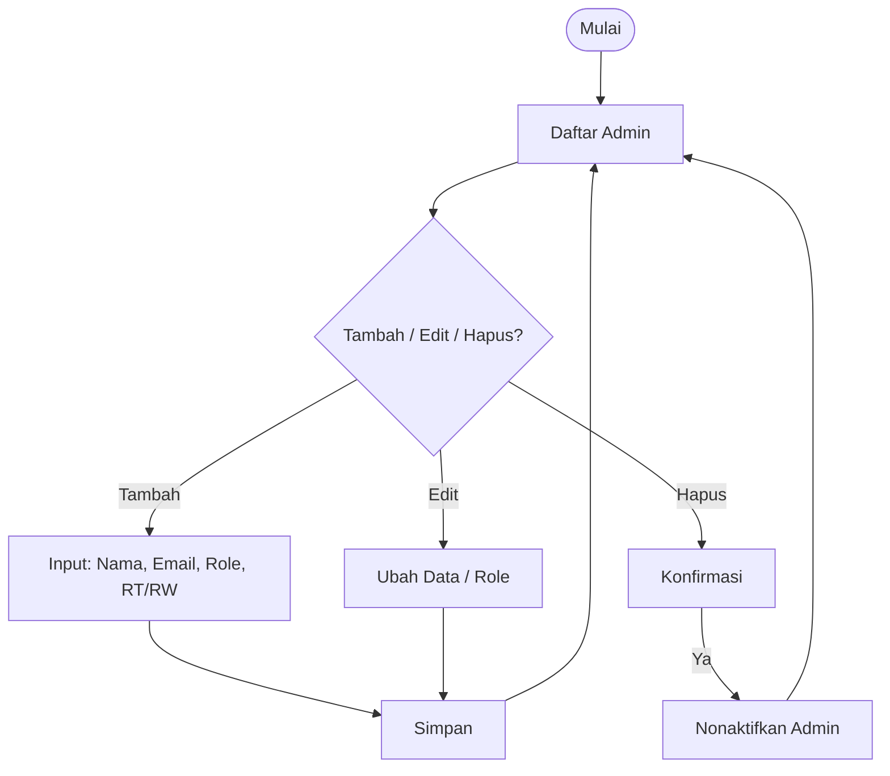
```mermaid
flowchart TD
    A([Mulai]) --> B[Daftar Admin]
    B --> C{Tambah / Edit / Hapus?}
    C -->|Tambah| D[Input: Nama, Email, Role, RT/RW]
    D --> E[Simpan]
    E --> B
    C -->|Edit| F[Ubah Data / Role]
    F --> E
    C -->|Hapus| G[Konfirmasi]
    G -->|Ya| H[Nonaktifkan Admin]
    H --> B
```

### 5.12 Logout

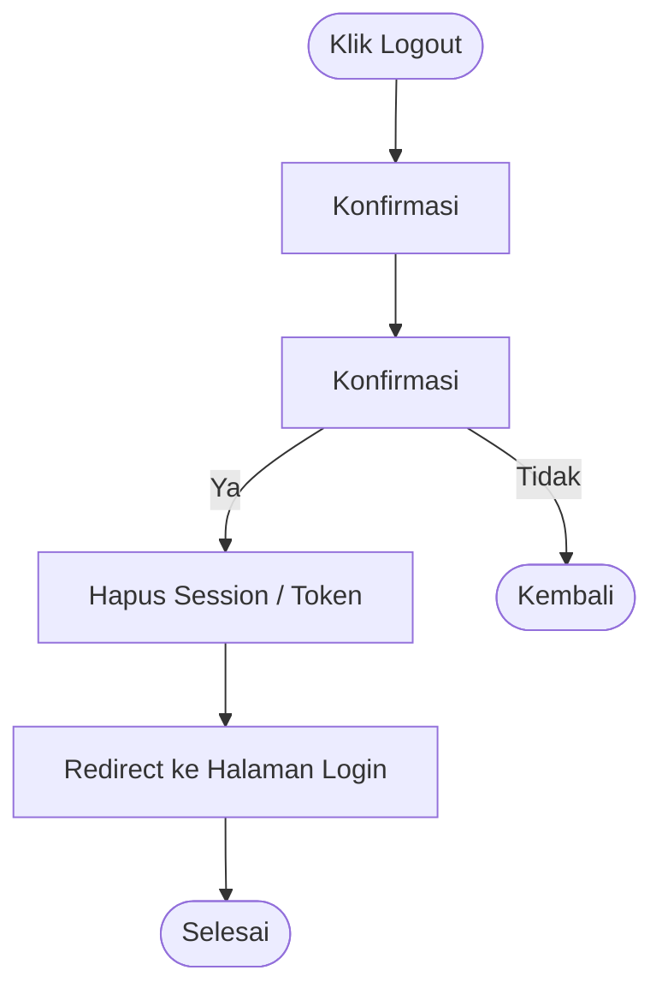
```mermaid
flowchart TD
    A([Klik Logout]) --> B[Konfirmasi]
    B --> C[Konfirmasi]
    C -->|Ya| D[Hapus Session / Token]
    D --> E[Redirect ke Halaman Login]
    E --> F([Selesai])
    C -->|Tidak| G([Kembali])
```

---

## 6. Flowchart Warga Mobile

### 6.1 Autentikasi

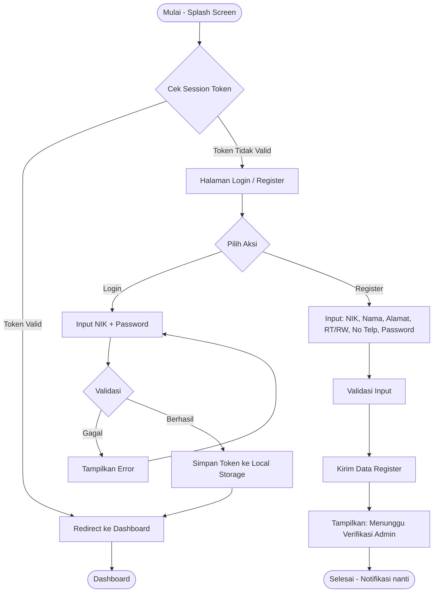
```mermaid
flowchart TD
    A([Mulai - Splash Screen]) --> B{Cek Session Token}

    B -->|Token Valid| C[Redirect ke Dashboard]
    B -->|Token Tidak Valid| D[Halaman Login / Register]

    D --> E{Pilih Aksi}

    E -->|Login| F[Input NIK + Password]
    F --> G{Validasi}
    G -->|Gagal| H[Tampilkan Error]
    H --> F
    G -->|Berhasil| I[Simpan Token ke Local Storage]
    I --> C

    E -->|Register| J[Input: NIK, Nama, Alamat, RT/RW, No Telp, Password]
    J --> K[Validasi Input]
    K --> L[Kirim Data Register]
    L --> M[Tampilkan: Menunggu Verifikasi Admin]
    M --> N([Selesai - Notifikasi nanti])

    C --> O([Dashboard])
```

### 6.2 Dashboard / Home

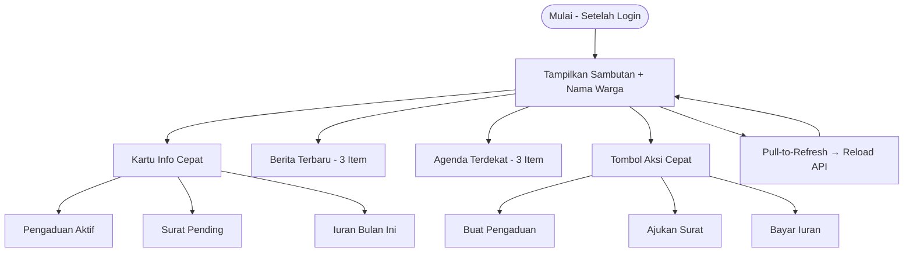
```mermaid
flowchart TD
    A([Mulai - Setelah Login]) --> B[Tampilkan Sambutan + Nama Warga]
    B --> C[Kartu Info Cepat]
    C --> D[Pengaduan Aktif]
    C --> E[Surat Pending]
    C --> F[Iuran Bulan Ini]

    B --> G[Berita Terbaru - 3 Item]
    B --> H[Agenda Terdekat - 3 Item]
    B --> I[Tombol Aksi Cepat]

    I --> J[Buat Pengaduan]
    I --> K[Ajukan Surat]
    I --> L[Bayar Iuran]

    B --> M[Pull-to-Refresh → Reload API]
    M --> B
```

### 6.3 Pengaduan

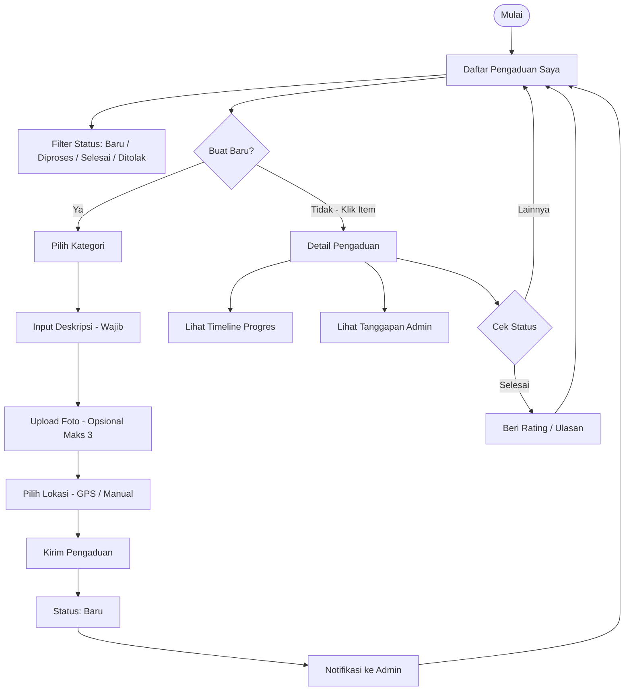
```mermaid
flowchart TD
    A([Mulai]) --> B[Daftar Pengaduan Saya]
    B --> C[Filter Status: Baru / Diproses / Selesai / Ditolak]

    B --> D{Buat Baru?}
    D -->|Ya| E[Pilih Kategori]
    E --> F[Input Deskripsi - Wajib]
    F --> G[Upload Foto - Opsional Maks 3]
    G --> H[Pilih Lokasi - GPS / Manual]
    H --> I[Kirim Pengaduan]
    I --> J[Status: Baru]
    J --> K[Notifikasi ke Admin]
    K --> B

    D -->|Tidak - Klik Item| L[Detail Pengaduan]
    L --> M[Lihat Timeline Progres]
    L --> N[Lihat Tanggapan Admin]
    L --> O{Cek Status}
    O -->|Selesai| P[Beri Rating / Ulasan]
    O -->|Lainnya| B

    P --> B
```

### 6.4 Surat

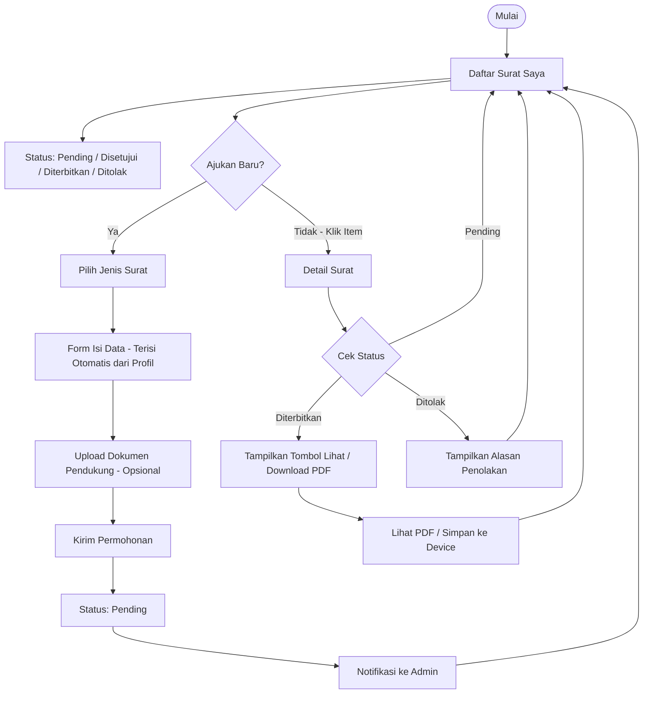
```mermaid
flowchart TD
    A([Mulai]) --> B[Daftar Surat Saya]
    B --> C[Status: Pending / Disetujui / Diterbitkan / Ditolak]

    B --> D{Ajukan Baru?}
    D -->|Ya| E[Pilih Jenis Surat]
    E --> F[Form Isi Data - Terisi Otomatis dari Profil]
    F --> G[Upload Dokumen Pendukung - Opsional]
    G --> H[Kirim Permohonan]
    H --> I[Status: Pending]
    I --> J[Notifikasi ke Admin]
    J --> B

    D -->|Tidak - Klik Item| K[Detail Surat]
    K --> L{Cek Status}

    L -->|Diterbitkan| M[Tampilkan Tombol Lihat / Download PDF]
    M --> N[Lihat PDF / Simpan ke Device]
    N --> B

    L -->|Ditolak| O[Tampilkan Alasan Penolakan]
    O --> B

    L -->|Pending| B
```

### 6.5 Iuran & Pembayaran

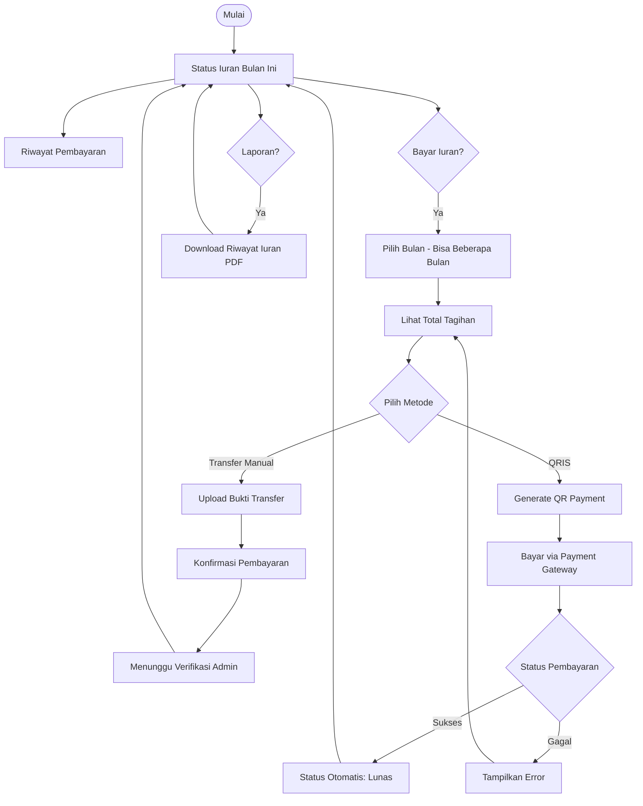
```mermaid
flowchart TD
    A([Mulai]) --> B[Status Iuran Bulan Ini]
    B --> C[Riwayat Pembayaran]

    B --> D{Bayar Iuran?}
    D -->|Ya| E[Pilih Bulan - Bisa Beberapa Bulan]
    E --> F[Lihat Total Tagihan]
    F --> G{Pilih Metode}

    G -->|Transfer Manual| H[Upload Bukti Transfer]
    H --> I[Konfirmasi Pembayaran]
    I --> J[Menunggu Verifikasi Admin]
    J --> B

    G -->|QRIS| K[Generate QR Payment]
    K --> L[Bayar via Payment Gateway]
    L --> M{Status Pembayaran}
    M -->|Sukses| N[Status Otomatis: Lunas]
    M -->|Gagal| O[Tampilkan Error]
    O --> F

    N --> B
    B --> P{Laporan?}
    P -->|Ya| Q[Download Riwayat Iuran PDF]
    Q --> B
```

### 6.6 Profil

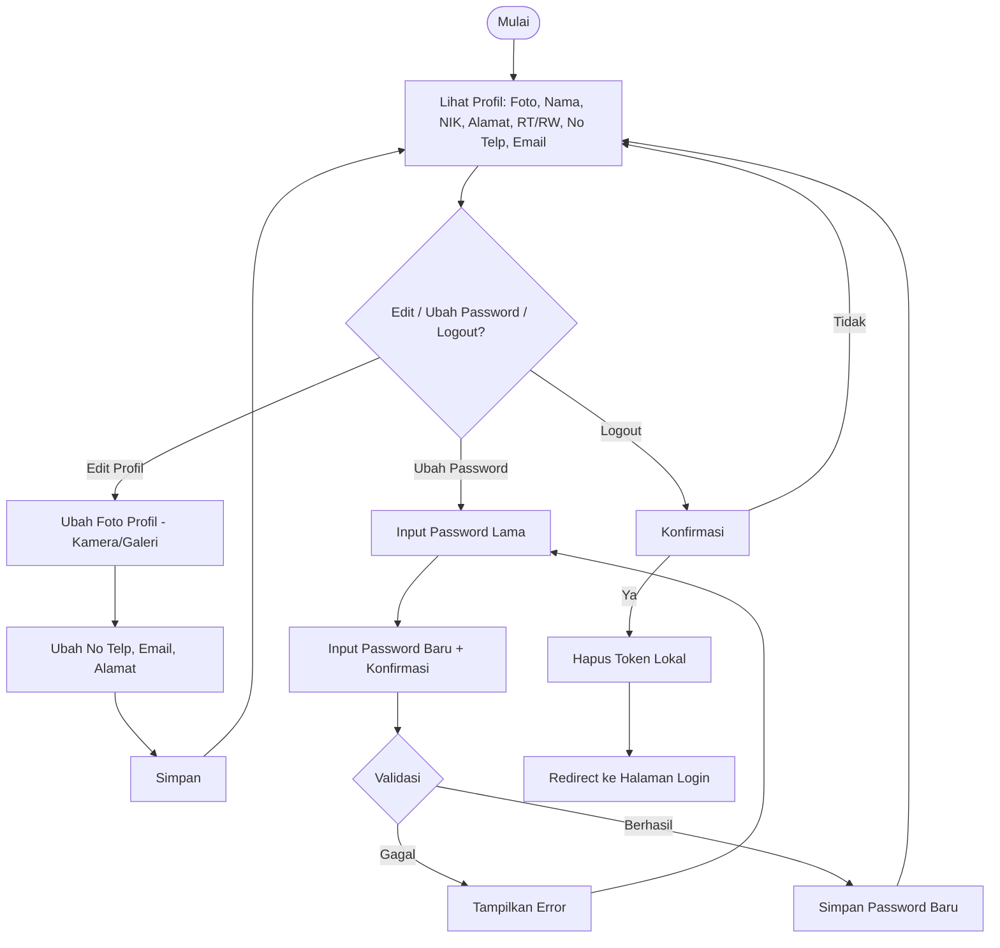
```mermaid
flowchart TD
    A([Mulai]) --> B[Lihat Profil: Foto, Nama, NIK, Alamat, RT/RW, No Telp, Email]
    B --> C{Edit / Ubah Password / Logout?}

    C -->|Edit Profil| D[Ubah Foto Profil - Kamera/Galeri]
    D --> E[Ubah No Telp, Email, Alamat]
    E --> F[Simpan]
    F --> B

    C -->|Ubah Password| G[Input Password Lama]
    G --> H[Input Password Baru + Konfirmasi]
    H --> I{Validasi}
    I -->|Gagal| J[Tampilkan Error]
    J --> G
    I -->|Berhasil| K[Simpan Password Baru]
    K --> B

    C -->|Logout| L[Konfirmasi]
    L -->|Ya| M[Hapus Token Lokal]
    M --> N[Redirect ke Halaman Login]
    L -->|Tidak| B
```

### 6.7 Agenda Kegiatan

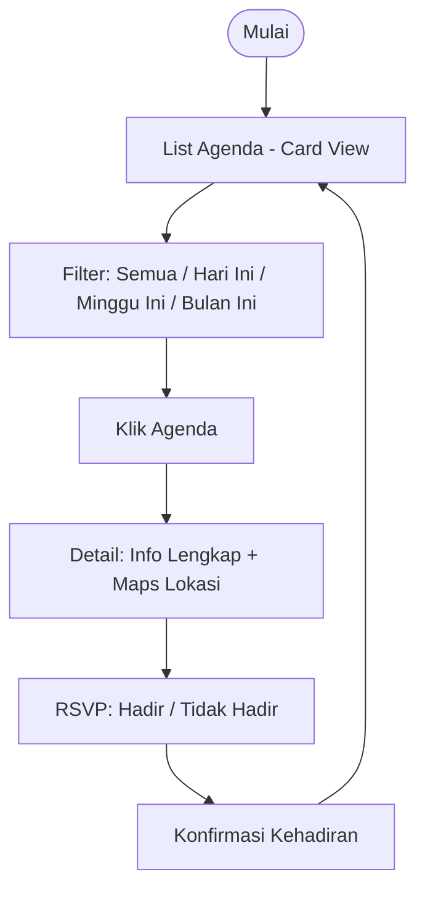
```mermaid
flowchart TD
    A([Mulai]) --> B[List Agenda - Card View]
    B --> C[Filter: Semua / Hari Ini / Minggu Ini / Bulan Ini]
    C --> D[Klik Agenda]
    D --> E[Detail: Info Lengkap + Maps Lokasi]
    E --> F[RSVP: Hadir / Tidak Hadir]
    F --> G[Konfirmasi Kehadiran]
    G --> B
```

### 6.8 Galeri

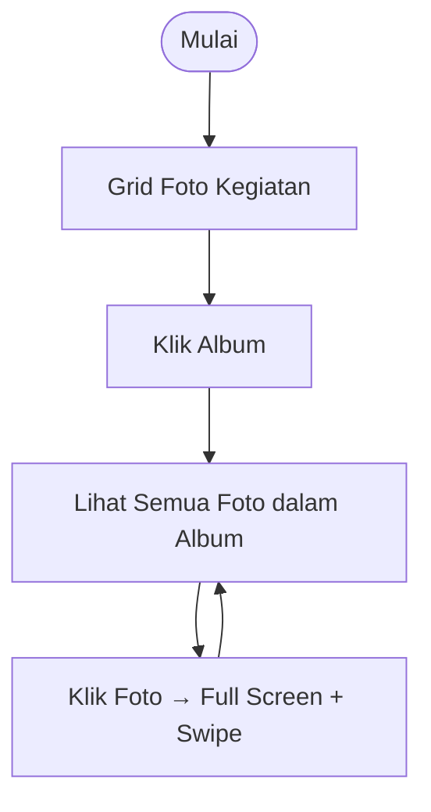
```mermaid
flowchart TD
    A([Mulai]) --> B[Grid Foto Kegiatan]
    B --> C[Klik Album]
    C --> D[Lihat Semua Foto dalam Album]
    D --> E[Klik Foto → Full Screen + Swipe]
    E --> D
```

### 6.9 Notifikasi

```mermaid
flowchart TD
    A([Mulai - Dari Mana Saja]) --> B[Terima FCM Push Notification]
    B --> C{Jenis Notifikasi}

    C -->|Pengaduan Diproses/Selesai| D[Navigasi ke Detail Pengaduan]
    C -->|Surat Diterbitkan/Ditolak| E[Navigasi ke Detail Surat]
    C -->|Iuran Jatuh Tempo| F[Navigasi ke Halaman Iuran]
    C -->|Agenda Baru/Pengingat| G[Navigasi ke Detail Agenda]
    C -->|Berita/Pengumuman Baru| H[Navigasi ke Detail Berita]
```

### 6.10 Navigasi Utama Aplikasi Mobile

```mermaid
flowchart TD
    A([Splash Screen]) --> B{Cek Login}
    B -->|Belum Login| C[Login / Register]
    B -->|Sudah Login| D[Home / Dashboard]

    C --> D

    D --> E[Bottom Navigation Bar]

    E --> F[Home]
    E --> G[Berita]
    E --> H[Layanan]
    E --> I[Notifikasi]
    E --> J[Profil]

    F --> D

    G --> K[List Berita]
    K --> L[Detail Berita]

    H --> M[Menu Layanan]
    M --> N[Pengaduan]
    M --> O[Surat]
    M --> P[Iuran]
    M --> Q[Agenda]
    M --> R[Galeri]

    I --> S[List Notifikasi]
    S --> T[Detail Notifikasi → Navigasi ke Halaman Terkait]

    J --> U[Profil Saya]
    U --> V[Edit Profil]
    U --> W[Ubah Password]
    U --> X[Logout]
    X --> A
```

---

## 7. Arsitektur Teknis

### 7.1 Stack Teknologi

| Lapisan | Teknologi | Catatan |
|---------|-----------|---------|
| **Backend API** | Laravel 13 | REST API, minimal PHP 8.3+, struktur skeleton baru Laravel 12/13 (tanpa `Kernel.php` terpisah, konfigurasi middleware & exception di `bootstrap/app.php`) |
| **Database** | MySQL 8 / PostgreSQL | Sesuai environment (XAMPP untuk lokal, MySQL/PostgreSQL untuk produksi) |
| **Admin Web (SPA)** | ReactJS 19 + Tailwind CSS v4 + shadcn/ui | Konsumsi API via Axios/Fetch, opsional Inertia.js jika ingin SPA menyatu dengan Laravel |
| **Mobile App** | Flutter (Dart) | State management: Provider/Riverpod/Bloc, konsumsi REST API |
| **Autentikasi** | Laravel Sanctum (API token) | Token per-device untuk mobile, cookie/token untuk web admin |
| **Notifikasi** | Firebase Cloud Messaging (FCM) | Push notification ke aplikasi Flutter |
| **Storage** | Laravel Storage (local/S3) | Untuk foto pengaduan, dokumen surat, bukti transfer, galeri |
| **Payment Gateway** | Midtrans / Xendit (QRIS) | Opsional untuk pembayaran iuran otomatis |
| **Queue & Job** | Laravel Queue (database/Redis) | Generate PDF surat, kirim notifikasi FCM secara asynchronous |
| **PDF Generator** | DomPDF / Laravel-Snappy | Generate surat resmi & laporan keuangan |

> **Catatan migrasi ke Laravel 13:** gunakan struktur folder default Laravel 13 (routing berbasis `bootstrap/app.php`), Eloquent dengan PHP 8.3+ features (readonly properties, enum casting), dan pastikan seluruh package pihak ketiga (Sanctum, Spatie Permission, dsb.) sudah kompatibel dengan Laravel 13 sebelum instalasi.

### 7.2 Struktur API

```
/api/v1/auth          → Login, Register, Logout, Refresh Token
/api/v1/warga         → CRUD data warga
/api/v1/berita        → CRUD berita & pengumuman
/api/v1/pengaduan     → CRUD pengaduan + timeline
/api/v1/surat         → CRUD permohonan surat + upload PDF
/api/v1/iuran         → Catat iuran, riwayat, laporan
/api/v1/keuangan      → Pemasukan & pengeluaran
/api/v1/agenda        → CRUD agenda kegiatan
/api/v1/galeri        → CRUD album & foto
/api/v1/rt-rw         → Struktur organisasi RT/RW
/api/v1/admin         → Manajemen admin
/api/v1/notifikasi    → Riwayat notifikasi + FCM token
/api/v1/dashboard     → Statistik dashboard admin & warga
/api/v1/profile       → Profil & ubah password
```

### 7.3 Relasi Database (High Level)

```
warga (1) ──── (N) pengaduan
warga (1) ──── (N) surat
warga (1) ──── (N) iuran
warga (N) ──── (1) rt_rw
admin (N) ──── (1) rt_rw
warga (N) ──── (N) agenda  →  tabel pivot kehadiran
```

### 7.4 Role & Permission

| Role | Level Akses |
|------|-------------|
| Super Admin | Akses penuh seluruh RT/RW, kelola admin lain |
| Admin RT/RW | Akses terbatas pada data RT/RW yang dikelola |
| Warga | Akses hanya pada data & pengajuan miliknya sendiri |

Disarankan menggunakan package **Spatie Laravel-Permission** untuk role & permission berbasis middleware di sisi API.

---

## 8. Non-Functional Requirements

| Aspek | Kebutuhan |
|-------|-----------|
| **Performa** | Response API < 500ms untuk endpoint umum, pagination wajib untuk data list |
| **Keamanan** | Validasi input di setiap endpoint, rate limiting login, enkripsi password (bcrypt/argon2), token expiry |
| **Skalabilitas** | API stateless agar mudah di-scale horizontal, queue worker terpisah untuk proses berat (PDF, notifikasi) |
| **Ketersediaan** | Uptime API minimal 99% pada environment produksi |
| **Kompatibilitas Mobile** | Mendukung Android 8+ dan iOS 13+ |
| **Aksesibilitas Web** | Responsive di desktop & tablet, mendukung browser modern (Chrome, Edge, Firefox) |
| **Backup Data** | Backup database otomatis harian |
| **Audit Trail** | Log aktivitas penting (approve/reject surat, ubah status pengaduan, transaksi keuangan) |

---

## 9. Fase Pengembangan

| Fase | Cakupan | Estimasi |
|------|---------|----------|
| **Fase 1 — Setup & Autentikasi** | Setup Laravel 13 API, Sanctum, setup React admin & Flutter project, modul autentikasi (login/register/logout) | 1–2 minggu |
| **Fase 2 — Modul Inti** | Data Warga, Berita & Pengumuman, RT/RW | 2–3 minggu |
| **Fase 3 — Layanan Warga** | Pengaduan, Surat (+ generate PDF), Notifikasi FCM | 3–4 minggu |
| **Fase 4 — Keuangan & Agenda** | Iuran & Keuangan (+ integrasi QRIS/Midtrans), Agenda Kegiatan, Galeri | 3 minggu |
| **Fase 5 — Dashboard & Manajemen Admin** | Dashboard statistik admin & warga, Manajemen Admin | 1–2 minggu |
| **Fase 6 — QA & Deployment** | Pengujian fungsional, bug fixing, deployment ke server produksi, Play Store/App Store submission (opsional) | 2 minggu |

---

## 10. Struktur Tim

| Peran | Jumlah | Tanggung Jawab |
|-------|--------|----------------|
| Project Manager | 1 | Koordinasi, sprint planning, progress report |
| Backend Developer | 1 | Laravel 13 API, database, autentikasi |
| Frontend Developer | 1 | ReactJS admin panel |
| Mobile Developer | 1 | Flutter aplikasi warga |
| UI/UX Designer | 1 | Desain antarmuka admin & mobile |
| QA Tester | 1 | Pengujian fungsional & bug reporting |

---

© 2026 — Portal Warga
